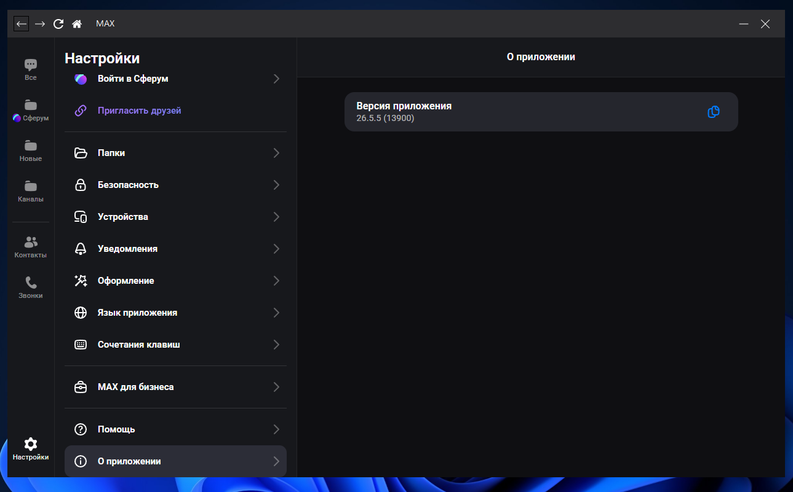

# WebMax



Заходите в MAX не устанавливая его на свой компьютер.

## Требуется:

- C# 10.0
- .NET 6.0
- WebView2

## Порядок запуска

1. Скачать `WebMax.exe` из раздела Releases
2. Установить WebView2 Runtime (при отсутствии)
3. Запустить `WebMax.exe`

## Сборка проекта

```bash
dotnet publish -c Release -r win-x64 --self-contained true -p:PublishSingleFile=true
